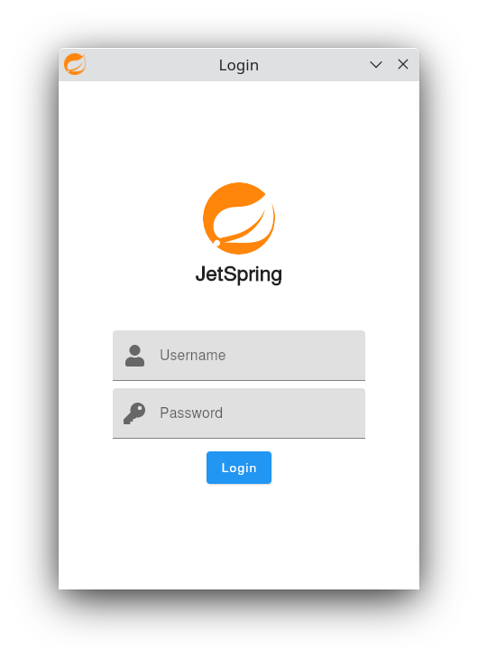
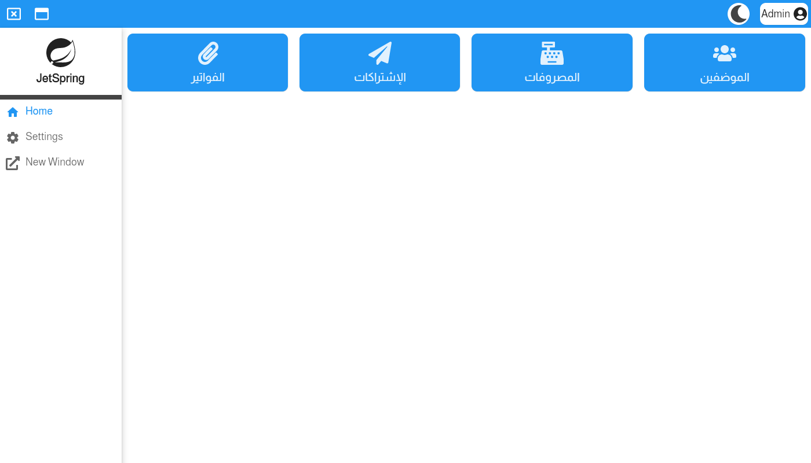
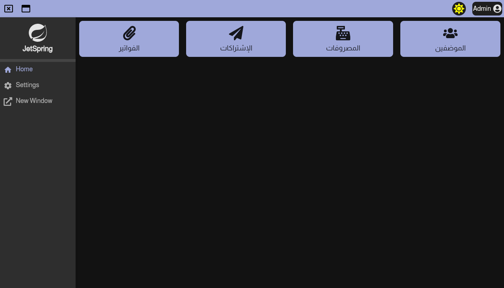

### JetSpring

Fullstack Desktop app using :

- Jetbrains Compose 🚀
- Spring boot & MySQL & Hibernate 🤠
- Kotlin ❤

##### Requirements

- For packaging the app as .deb or .exe file you need Java JDK 15+
- Install MySQL server and create a database named *jet_spring* take a look
  at [application.properties](src/jvmMain/resources/application.properties) to config database

### Screenshots

#### Login Screen

###### Default authentication info

- Username : *admin@jetspring.com*
- Password : *admin*
- Config default info in [DataGenerator.kt](src/jvmMain/kotlin/ixidev/jetspring/data/DataGenerator.kt)
  

#### Home Screen

#### Home Screen Dark

### Show some ❤ by stare the repo

